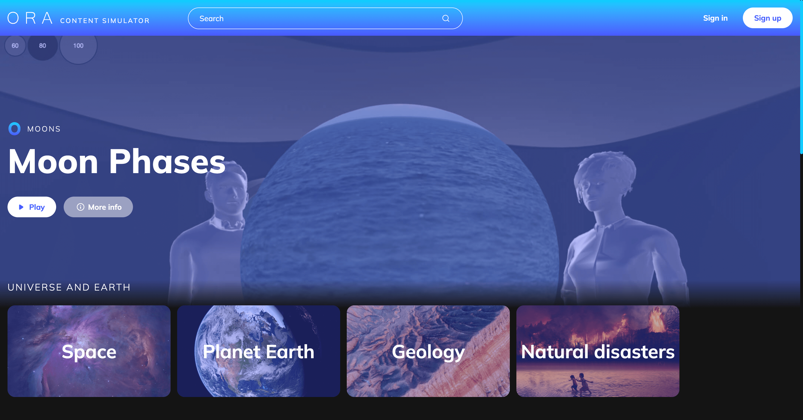

<h1 align="center">ORA content simulator</h1>


## Project Objective
The goal of the project is to develop an application that allows users to select video content and project it onto ORA Sphere Simulator.

## Overview
This project is a Vue.js application built with TypeScript, integrating Plyr.js and Babylon.js to provide an interactive experience using ORA Sphere Simulator.

### Tech stack:
- Vue 3 (Composition API)
- TypeScript
- Plyr.js (Media player)
- Babylon.js (3D rendering engine)
- Vite (Development & build tool)

### Features
- Ensures type safety and maintainability
- Provides a customizable and lightweight media player
- Enables 3D rendering and interactions within the simulator
- Synchronizes video playback with 3D model interactions
- Automatically deploys new changes from the repository, ensuring a fast and efficient deployment process.

## Requirements:
Project requires Node.js version 18+. Feel free to install it via [nvm](https://github.com/nvm-sh/nvm) or [asdf](https://asdf-vm.com) with [Node.js plugin](https://asdf-vm.com/guide/getting-started.html#_4-install-a-plugin).
Optional: [pnpm](https://pnpm.io/).

## Getting started:

### Install dependencies:

```sh
# npm
$ npm i

# pnpm
$ pnpm install
```

### Prepare local environment:

Prepare `husky` to automatically lint your commit messages, code, and run tests upon committing or pushing

```sh
$ npm run prepare
```

### Start Vite dev server:

```sh
$ npm run dev
```

### Build project:

```sh
$ npm run build
```

### Preview the build:

```sh
$ npm run preview
```

### Analyze your code with ESLint:

```sh
$ npm run lint
```

### Type checking via Vue Typescript Services:

```sh
$ npm run vue-tsc
```

